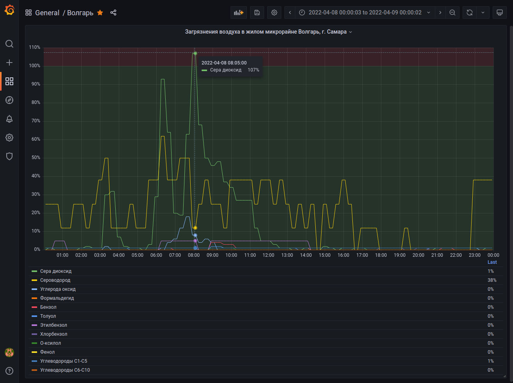

# Volgar pollution Adapter
Набор приложений, позволяющий получать, хранить и визуализировать исторические данные для http://pogoda-sv.ru/pollcenter/volgar/ , который отдаёт только текущие значения загрязнений воздуха в жилом микрорайне "волгарь", г. Самара.




### Используемые стек:
- FastAPI
- Prometheus
- Grafana

### Сборка и запуск в докере (Python):
```
docker-compose up
```
запускает три компонента:
- adapter (трансляция данных с сервера pogodasv)
- prometheus_volgar (хранения данных в БД)
- grafana_volgar (визуализация данных)

###

Используются папка grafana, файлы docker-compose.yml, .env и Dockerfile из корня проекта. В переменных .env должно содержаться только MY_SECRET_PASS для пароля в админку графаны
